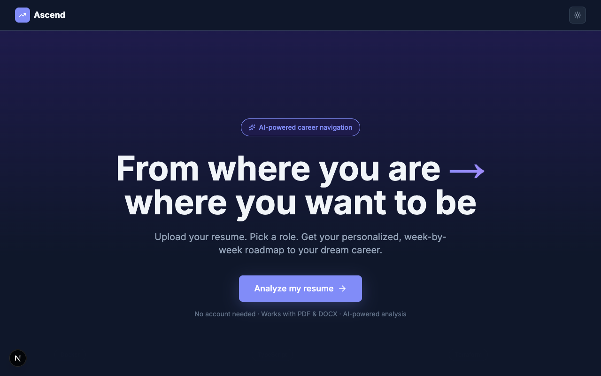
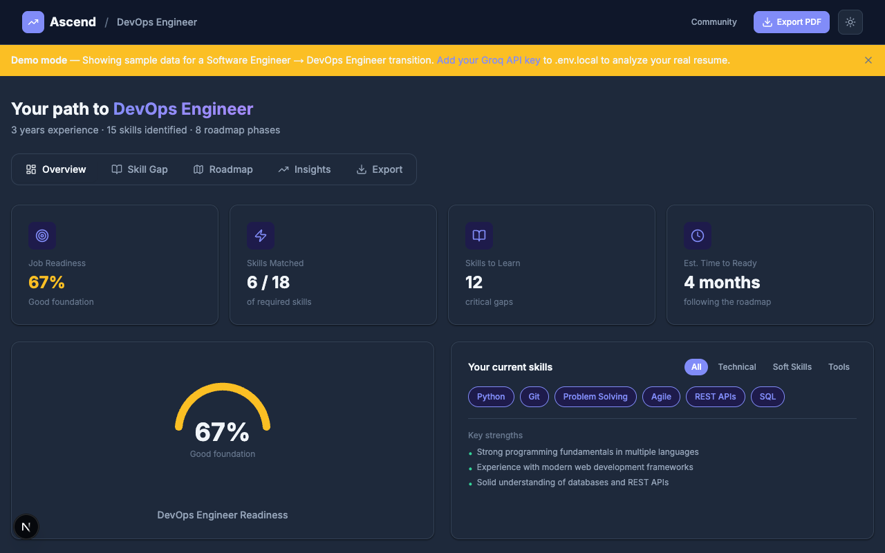
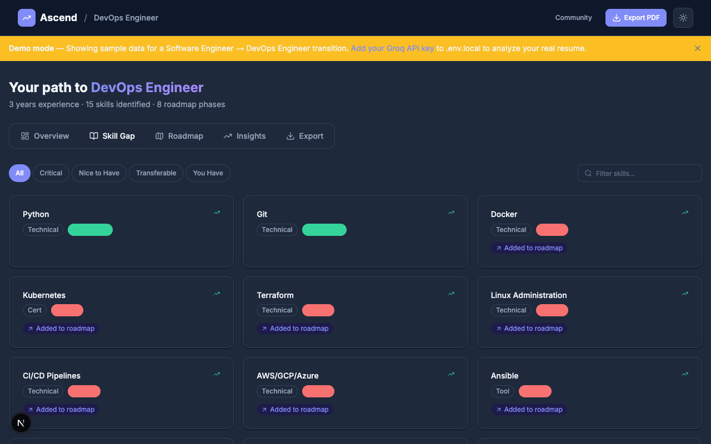
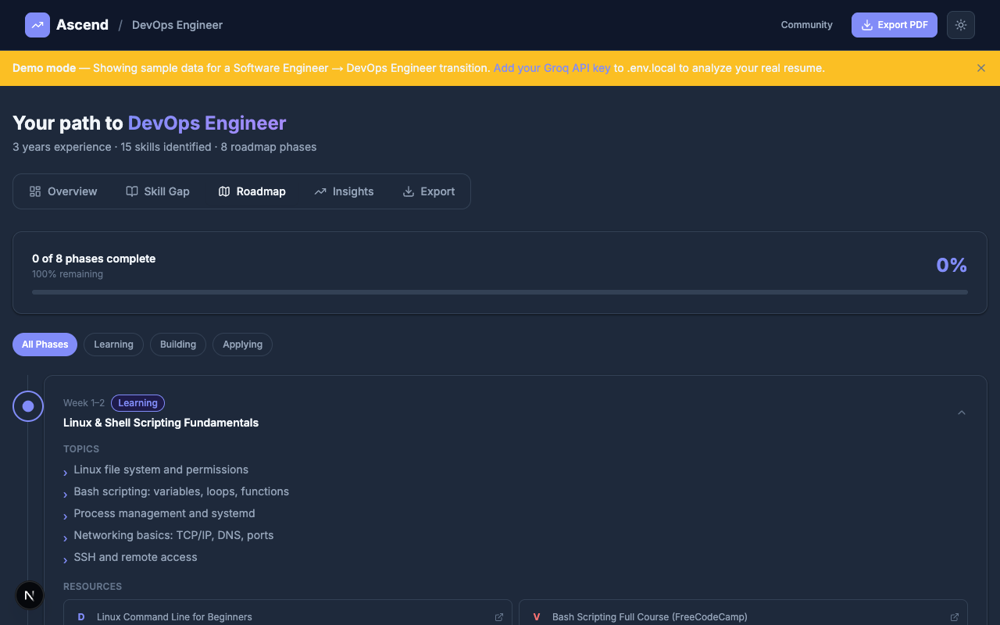
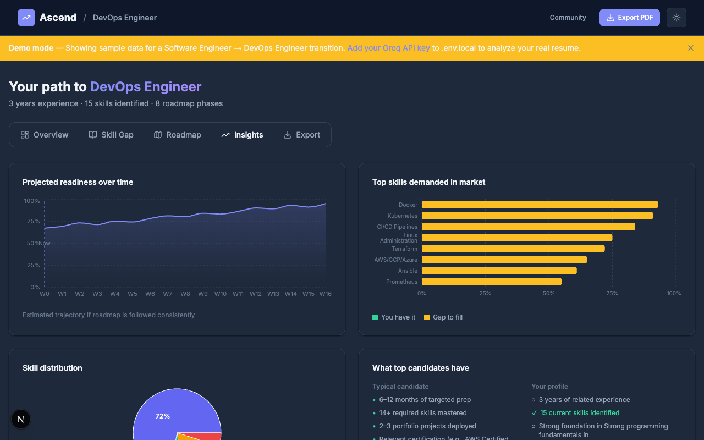

<div align="center">

# 🚀 Ascend

### AI-powered career navigation — from your resume to your dream role


Upload your resume. Pick a target role. Get a personalized, week-by-week AI roadmap with curated resources, hands-on projects, and skill gap analysis — running locally with zero setup.



</div>

---

## ✨ Features

- **📄 Resume upload** — drag-and-drop PDF or DOCX, or use the built-in sample resume
- **🎯 80+ roles** — autocomplete search across 10 industries with salary & demand data
- **🤖 Live AI analysis** — 4-stage Groq pipeline: skill extraction → role requirements → gap analysis → roadmap generation
- **📊 5-tab dashboard:**
  - **Overview** — readiness gauge, matched skills, key strengths
  - **Skill Gap** — filterable grid of critical / nice-to-have / transferable skills
  - **Roadmap** — collapsible week-by-week timeline with resources and projects
  - **Insights** — 4 charts: projections, market demand, skill radar, role breakdown
  - **Export** — one-click PDF report, no server required
- **💬 Community feed** — anonymized activity from other users, trending skills
- **🌙 Dark / light mode** — instant toggle, zero flicker
- **🎭 Demo mode** — fully functional with realistic sample data when no API key is set

---

## 📸 Screenshots

<table>
  <tr>
    <td></td>
    <td></td>
  </tr>
  <tr>
    <td align="center"><b>Overview - readiness score & matched skills</b></td>
    <td align="center"><b>Skill Gap - what you have vs. what you need</b></td>
  </tr>
  <tr>
    <td></td>
    <td></td>
  </tr>
  <tr>
    <td align="center"><b>Roadmap - week-by-week learning plan</b></td>
    <td align="center"><b>Insights - charts & market data</b></td>
  </tr>
</table>

---

## ⚡ Quick start

> Works on Mac, Windows, and Linux. Only requires Node.js.

**1. Install Node.js** (if you don't have it)
→ Download from [nodejs.org](https://nodejs.org) and run the installer.

**2. Clone and install**
```bash
git clone https://github.com/JayP0809/ascend.git
cd ascend
npm install
```

**3. Run the app**

Click **▶ Run Ascend** in the VS Code sidebar, or:
```bash
npm run dev
```

Open [http://localhost:3000](http://localhost:3000) — the app works immediately in demo mode, no API key needed.

---

## 🤖 Enable live AI analysis

By default Ascend runs in **demo mode** with realistic pre-generated data. To analyze your real resume with AI:

1. Get a **free** API key at [console.groq.com](https://console.groq.com) → API Keys → Create new key
2. Open `.env.local` in the project root
3. Replace the placeholder with your key:
   ```
   GROQ_API_KEY=gsk_your_key_here
   ```
4. Restart the app — live mode activates automatically

---

## 🛠️ Tech stack

| Layer | Technology |
|---|---|
| **Framework** | Next.js 15 (App Router) + TypeScript |
| **Styling** | Tailwind CSS + CSS custom properties |
| **AI** | Groq API — `llama-3.3-70b-versatile` |
| **Database** | SQLite via `better-sqlite3` (auto-created, no setup) |
| **Charts** | Recharts — 5 chart types |
| **Animations** | Framer Motion |
| **Resume parsing** | `pdf-parse` + `mammoth` |
| **PDF export** | `jsPDF` + `jspdf-autotable` |
| **Icons** | `lucide-react` |
| **Theming** | `next-themes` |

---

## 🗂️ Project structure

```
ascend/
├── app/
│   ├── page.tsx               ← Landing page
│   ├── dashboard/page.tsx     ← Dashboard (5 tabs)
│   └── api/
│       ├── upload/            ← Parse PDF/DOCX, save to SQLite
│       ├── analyze/           ← AI pipeline or demo fallback
│       ├── roles/             ← Role search autocomplete
│       ├── export/            ← Analysis data for PDF export
│       └── community/         ← Anonymized community feed
├── components/
│   ├── ui/                    ← Button, Card, Badge, Dialog, Tabs…
│   ├── charts/                ← ReadinessGauge, SkillGapChart…
│   ├── landing/               ← Hero, RoleSampleCards
│   ├── upload/                ← ResumeDropzone, RoleSearch, AnalysisLoader
│   ├── dashboard/             ← DashboardTabs, OverviewTab, RoadmapTab…
│   └── shared/                ← Navbar, ThemeToggle
├── lib/
│   ├── ai.ts                  ← Groq pipeline + demo mode fallback
│   ├── db.ts                  ← SQLite connection + auto-schema
│   ├── parser.ts              ← PDF and DOCX text extraction
│   ├── roles.ts               ← 80+ roles with metadata
│   ├── scorer.ts              ← Readiness score + dashboard data builder
│   └── types.ts               ← Shared TypeScript interfaces
├── styles/globals.css         ← CSS variables (light + dark), animations
├── screenshots/               ← README screenshots
├── .env.local                 ← Add your Groq API key here
└── .env.example               ← Template (safe to commit)
```

---

## 🧠 How it works

```
Your Resume (PDF/DOCX)
        ↓
   Text Extraction
        ↓
┌─────────────────────────────────────────┐
│           Groq AI Pipeline              │
│  1. Extract skills & experience         │
│  2. Fetch role requirements             │
│  3. Perform gap analysis                │
│  4. Generate week-by-week roadmap       │
└─────────────────────────────────────────┘
        ↓
   Interactive Dashboard
  (saved to local SQLite)
```

---

## 📋 What this demonstrates

Built as a portfolio piece showcasing production-grade full-stack engineering:

| Skill | Implementation |
|---|---|
| **Next.js 15 App Router** | Server components, API routes, dynamic routing |
| **TypeScript** | Strict mode, zero `any`, full type coverage |
| **AI integration** | Groq API with 4-stage sequential prompt pipeline |
| **Data visualization** | Recharts — radial gauge, area, bar, pie charts |
| **Theming** | CSS custom properties + `next-themes` + Tailwind dark mode |
| **SQLite** | Auto-created DB, WAL mode, typed sync API, no ORM |
| **Resume parsing** | PDF via `pdf-parse`, DOCX via `mammoth` |
| **Animations** | Framer Motion — AnimatePresence, staggered effects |
| **PDF export** | Client-side `jsPDF` — no server required |
| **Demo mode** | Full realistic dataset when no API key is configured |

---

## 📄 License

MIT — free to use, fork, and deploy.
